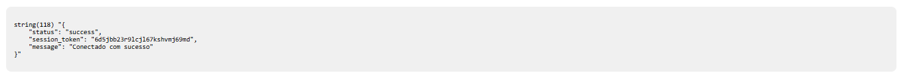
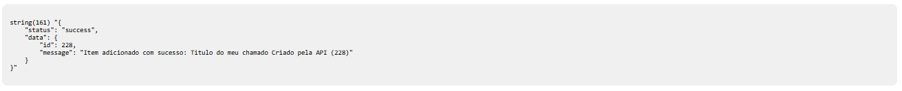
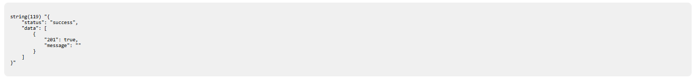

# Integration Code with GLPi API 🚀

If you liked the repository, please add a star to help out.

This test program was designed to perform various essential functionalities using the GLPI API.

## ➡️ Code Functionalities

1. **Initiate session:** initSession()
2. **End sessão:** killSession()
3. **Request:** requestItem()
4. **Add:** addItem()
5. **Update:** updateItem()
6. **Soft delete (move to trash):** deleteItem()
7. **Hard delete (permanetly):** purgeItem()
8. **Document submission:** sendDocuments()

## ➡️ Installation

1. Install the program inside the /var/www/html folder or analyze the directory where PHP is installed for rendering.
2. Execute the composer dump-autoload command to download the necessary libraries.
3. Access the program directory via the web and execute.

## ➡️ Screens

#glpi #api #php
